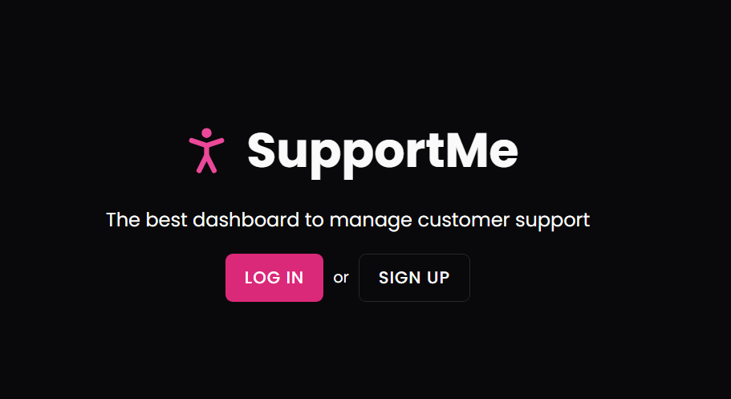
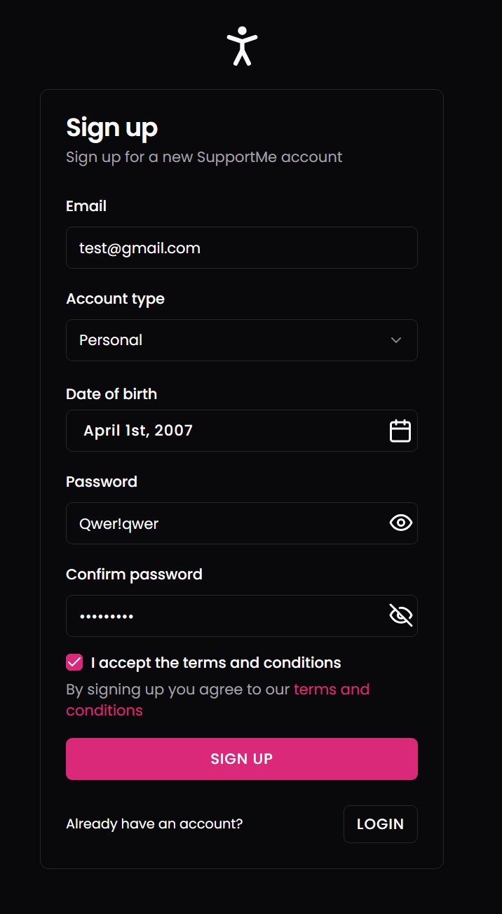
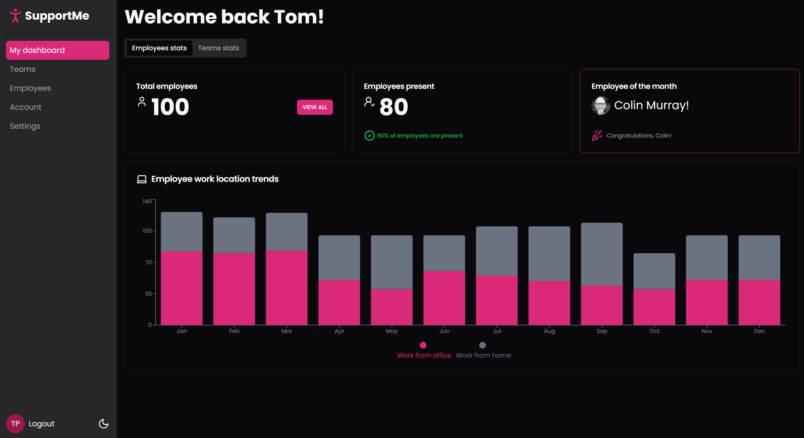
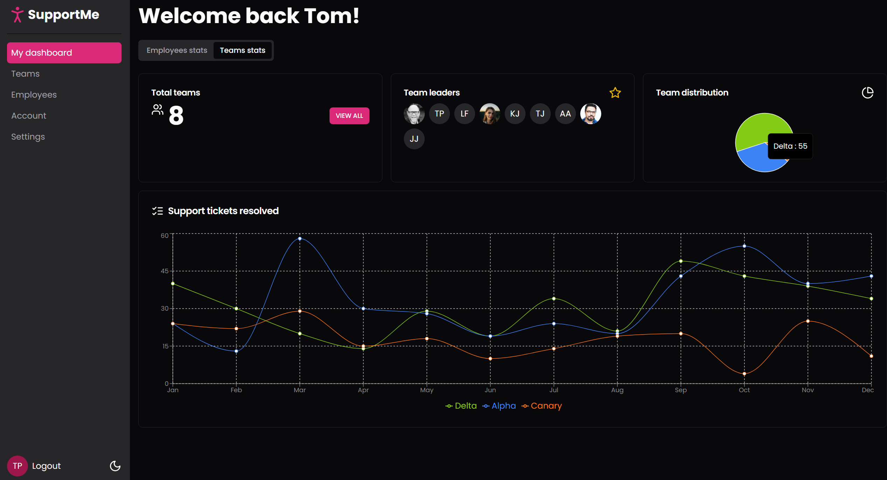
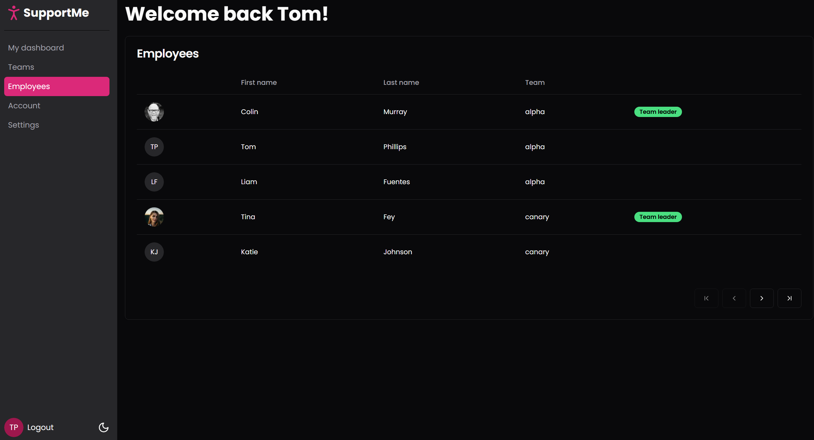

# Support Me Dashboard

A modern, responsive dashboard application built with Next.js 14, TypeScript, and shadcn/ui components. This project demonstrates a comprehensive admin dashboard with employee and team management features, statistics visualization, and authentication.

## 🚀 Live Demo

👉 [https://shadcn-dashboard-pearl.vercel.app/](https://shadcn-dashboard-pearl.vercel.app/)

## 🚀 Features

- **Dashboard Overview**: Interactive tabs for employee and team statistics
- **Employee Management**: View and manage employee data with detailed statistics
- **Team Management**: Team organization and performance metrics
- **Authentication**: Secure login system with session management
- **Responsive Design**: Mobile-first approach with Tailwind CSS
- **Dark Mode**: Built-in dark theme support
- **Modern UI**: Beautiful components using shadcn/ui and Radix UI

## 🛠️ Tech Stack

- **Framework**: Next.js 14 with App Router
- **Language**: TypeScript
- **Styling**: Tailwind CSS with CSS variables
- **UI Components**: shadcn/ui (Radix UI primitives)
- **Forms**: React Hook Form with Zod validation
- **Charts**: Recharts for data visualization
- **Icons**: Lucide React
- **Fonts**: Poppins from Google Fonts

## 📦 Dependencies

### Core Dependencies

- Next.js 14.0.4
- React 18
- TypeScript 5

### UI & Styling

- @radix-ui/\* (various UI primitives)
- tailwindcss 3.4.0
- class-variance-authority
- clsx & tailwind-merge
- tailwindcss-animate

### Forms & Validation

- react-hook-form 7.72.0
- @hookform/resolvers
- zod 3.25.76

### Data & Charts

- @tanstack/react-table
- recharts 2.15.4
- date-fns 3.6.0

### Additional Libraries

- lucide-react (icons)
- react-day-picker
- react-responsive
- vaul (drawer component)

## 🚀 Getting Started

### Prerequisites

- Node.js 18+
- npm or yarn

### Installation

1. Clone the repository:

```bash
git clone https://github.com/vasylpryimakdev/shadcn-dashboard.git
cd shadcn-dashboard
```

2. Install dependencies:

```bash
npm install
```

3. Run the development server:

```bash
npm run dev
```

4. Open [http://localhost:3000](http://localhost:3000) in your browser.

## 📁 Project Structure

```
├── app/                    # Next.js app directory
│   ├── dashboard/         # Dashboard routes
│   │   ├── account/       # Account management
│   │   ├── employees/     # Employee management
│   │   ├── settings/      # Application settings
│   │   └── teams/         # Team management
│   ├── (logged-out)/      # Authentication pages
│   ├── globals.css        # Global styles
│   └── layout.tsx         # Root layout
├── components/            # Reusable UI components
│   ├── ui/               # shadcn/ui components
│   └── dashboard/        # Dashboard-specific components
├── lib/                  # Utility functions
├── public/               # Static assets
└── tailwind.config.ts    # Tailwind configuration
```

## 🎯 Available Scripts

- `npm run dev` - Start development server
- `npm run build` - Build for production
- `npm run start` - Start production server
- `npm run lint` - Run ESLint

## 🎨 Customization

### Theme Customization

The project uses CSS variables for theming. Modify `tailwind.config.ts` and `app/globals.css` to customize colors and styles.

### Adding New Components

This project uses shadcn/ui for component management. Add new components using:

```bash
npx shadcn-ui@latest add [component-name]
```

## 🔧 Development

### Code Style

- ESLint configuration for consistent code quality
- TypeScript for type safety
- Prettier recommended for formatting

### Component Architecture

- Components are organized by feature
- Reusable UI components in `components/ui/`
- Dashboard-specific components in `components/dashboard/`

## 📊 Features in Detail

### Dashboard

- **Employee Statistics**: View employee metrics, performance data, and analytics
- **Team Statistics**: Monitor team performance, collaboration metrics
- **Tabbed Interface**: Easy navigation between different data views

### Management Sections

- **Account**: User profile and account settings
- **Employees**: Complete employee management system
- **Teams**: Team organization and management
- **Settings**: Application configuration

## Screenshots

### Preview

| Auth Page                                   | Sign Up                                      | Dashboard                                        |
| ------------------------------------------- | -------------------------------------------- | ------------------------------------------------ |
|  |  |  |

| Team Stats                                   | Employees                                      |
| ------------------------------------------- | -------------------------------------------- |
|  |  |

## 🤝 Contributing

1. Fork the repository
2. Create a feature branch (`git checkout -b feature/amazing-feature`)
3. Commit your changes (`git commit -m 'Add some amazing feature'`)
4. Push to the branch (`git push origin feature/amazing-feature`)
5. Open a Pull Request

## 🙏 Acknowledgments

- [shadcn/ui](https://ui.shadcn.com/) for beautiful UI components
- [Next.js](https://nextjs.org/) for the React framework
- [Tailwind CSS](https://tailwindcss.com/) for the utility-first CSS framework
- [Radix UI](https://www.radix-ui.com/) for accessible UI primitives
